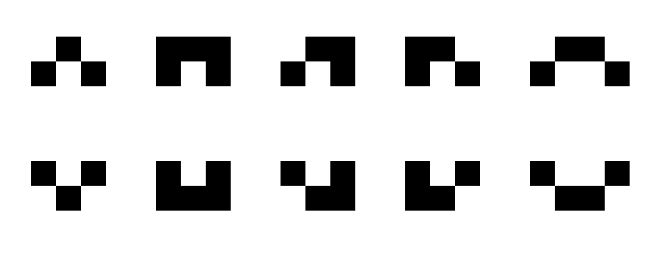

# homeTask
### task's goal:
For a given contour and a point (x,y), return: 
True   if the point is inside the contour  
False  otherwise. 
 
### pseudo code:
1. input validation 
2. if point on contour: return FALSE 
3. if min (p_x, image_with-p_x) == p_x: ray_x_2 = 0 (go from point to left image border). 
   else: ray_x_2 = image_width (go from point to right image border).  
   ray = (point , (ray_x_2, poiny_y))
   counter = 0  
   inside = FALSE  
4. for i from point to border: 
    vertex_flag = 0  
    if cross contour:  
      if current pixel < image_width: 
         vertex_flag <- check if the currnt pixel is vertex or part of edge  
      else: (current black pixel on the rightmost pixel) 
         counter += 0.5  
      if current pixel not vertex or part of edge:  
         counter +=0.5 
 5. if counter odd: inside = TRUE 
    else: inside = FALSE  
     
     הסבר לפסאודו קוד:
     1. בדיקת תקינות קלט - שגודל התמונה שהוכנס הוא אכן גודל התמונה שהתקבלה, ושהנקודה נמצאת בתוך גבולות התמונה.
     בנוסף בדקתי שהתמונה בגודל מינימלי של 3 על 3 (ככה יכולה בטוח להיות בה צורה סגורה)  
     2. בדיקה אם קבלנו נקודה שהפיקסל שלה בצבע שחור - כלומר היא על הצורה ולכן נחזיר שקר  
     3.  בדיקה לאיזה כיוון הכי קצר למתוח את הקרן (כדי לחסוך במספר האיטרציות ולקצר בזמן ריצה) מהנקודה לשמאל או מהנקודה לימין. 
     * הערה: ניתן לבדוק עדיפות גם כלפי מעלה ומטה ולממש שיטה שבודקת קודקודים וצלעות בכיוון זה 
     איתחול המשתנים - מונה = 0, המשתנה הבוליאני = שקר 
     4. רצים לאורך הקרן ובודקים האם נתקלנו בצורה, אם כן בודקים מקרים שאותם לא נרצה לספור (קוקוד עליון או תחתון, או חלק מצלע אופקית כלפי מטה או חלק מצלע אופקית כלפי מעלה) מצורפת למטה תמונה להמחשה .  
     אם הכל תקין נעלה את המונה בחצי (מעלים בחצי בגלל שפעם אחת השינוי הוא מלבן לשחור ובפעם השניה זה משחור לבן, ככה שבסוף המעבר על הצורה הקאונטר יעלה ב1).  
     5. בודקים האם המונה זוגי- אם כן אנחנו מחוץ לצורה ונחזיר שקר, אחרת נחזיר אמת.
     
  ### :יעילות
  כפי שציינתי - ניתן לבחור את המסלול הקצר ביותר מהנקודה לאחד הגבולות של התמונה. ולכן במקרה הכי גרוע נרוץ חצי מרוחב התמונה או חצי מאורך התמונה (הנמוך מבינהם) כלומר: 
  o(h/2) = o(h) או o(w/2) = o(W)  
  h - אורך התמונה w- רוחב התמונה  
     

    
#### סוגי קודקודים שבדקתי: 
 
     
